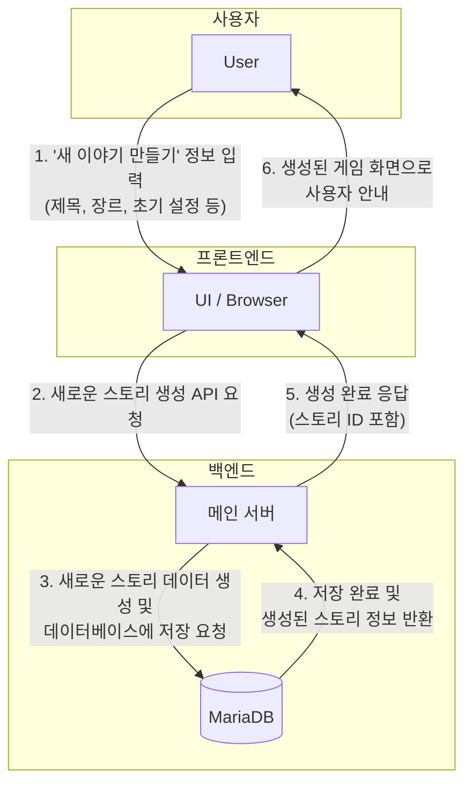
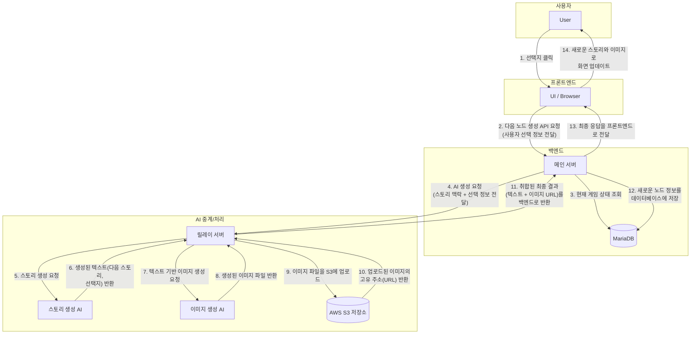

# 시스템 상세 흐름: 게임 생성 및 스토리 노드 생성

이 문서는 'IF STORY' 서비스의 두 가지 핵심 흐름인 '게임 생성'과 '스토리 노드 생성' 과정을 각각의 다이어그램과 함께 상세하게 설명합니다.

---

## 1. 게임 생성 흐름

사용자가 자신만의 새로운 이야기를 처음 만드는 과정입니다. 이 단계는 주로 프론트엔드와 메인 백엔드 서버, 그리고 데이터베이스 사이의 상호작용으로 이루어집니다.

### 게임 생성 다이어그램

### 게임 생성 상세 설명

1.  **사용자 입력:** 사용자는 프론트엔드 화면에서 '새 이야기 만들기' 페이지에 접속하여, 만들고 싶은 이야기의 제목, 장르, 초기 상황 등 기본 정보를 입력하고 '생성' 버튼을 누릅니다.
2.  **API 요청 (프론트엔드 → 백엔드):** 프론트엔드는 사용자가 입력한 정보들을 가지고 '새로운 스토리를 생성해달라'는 요청을 메인 백엔드 서버로 보냅니다.
3.  **데이터베이스 저장 (백엔드 → DB):** 백엔드 서버는 요청을 받고, 새로운 스토리 정보를 데이터베이스에 저장할 형식으로 가공합니다. 그 후 데이터베이스에게 이 새로운 스토리 데이터를 저장하라고 명령합니다.
4.  **저장 결과 반환 (DB → 백엔드):** 데이터베이스는 전달받은 스토리 정보를 성공적으로 저장한 후, 저장된 데이터(고유 ID가 포함된)를 백엔드 서버로 다시 돌려줍니다.
5.  **생성 완료 응답 (백엔드 → 프론트엔드):** 백엔드 서버는 데이터베이스로부터 저장이 완료되었음을 확인하고, "생성 성공"이라는 상태와 함께 새로 만들어진 스토리의 고유 ID를 프론트엔드에 전달합니다.
6.  **화면 전환:** 프론트엔드는 생성된 스토리 ID를 받아, 이제 막 만들어진 따끈따끈한 이야기의 첫 페이지로 사용자를 안내합니다. 이로써 사용자는 자신만의 모험을 시작할 준비를 마칩니다.

---

## 2. 스토리 노드 생성 흐름

사용자가 이야기 속에서 내린 선택을 바탕으로, AI가 다음 이야기와 장면을 만들어내는 복잡하고 동적인 과정입니다. 시스템의 모든 구성 요소가 이 과정에 참여합니다.

### 스토리 노드 생성 다이어그램

### 스토리 노드 생성 상세 설명

1.  **사용자 선택:** 사용자는 프론트엔드 화면에 펼쳐진 이야기와 선택지를 보고, 그중 하나를 클릭합니다.
2.  **API 요청 (프론트엔드 → 백엔드):** 프론트엔드는 "사용자가 O번 선택지를 골랐으니, 다음 이야기를 만들어달라"는 요청을 메인 백엔드 서버로 보냅니다.
3.  **상태 조회 (백엔드 ↔ DB):** 백엔드는 요청에 담긴 정보를 바탕으로, 데이터베이스에서 현재 게임의 진행 상황과 스토리 맥락을 가져옵니다.
4.  **AI 요청 (백엔드 → 릴레이):** 백엔드는 조회한 스토리 맥락과 사용자의 선택 정보를 종합하여, '릴레이 서버'에게 "AI를 이용해 이 상황에 맞는 다음 장면을 만들어줘"라고 요청합니다.
5.  **스토리 생성 (릴레이 → AI):** 릴레이 서버는 백엔드의 요청을 받아 '스토리 생성 AI'에게 핵심 정보를 전달하며 다음 이야기(텍스트)와 그에 따른 새로운 선택지들을 만들어달라고 요청합니다.
6.  **텍스트 반환:** '스토리 생성 AI'는 요청받은 내용을 바탕으로 새로운 이야기와 선택지를 생성하여 릴레이 서버로 돌려줍니다.
7.  **이미지 생성 (릴레이 → AI):** 릴레이 서버는 방금 받은 이야기 텍스트를 기반으로, '이미지 생성 AI'에게 "이 텍스트 내용에 어울리는 장면을 그림으로 만들어줘"라고 요청합니다.
8.  **이미지 파일 반환:** '이미지 생성 AI'는 그림을 완성하여 이미지 파일을 릴레이 서버로 돌려줍니다.
9.  **S3 업로드 (릴레이 → S3):** 릴레이 서버는 이미지 파일을 영구적으로 보관하기 위해 'AWS S3 저장소'에 업로드합니다.
10. **URL 반환 (S3 → 릴레이):** S3는 업로드된 이미지에 누구나 접근할 수 있는 고유한 웹 주소(URL)를 생성하여 릴레이 서버에 알려줍니다.
11. **결과 취합 및 반환 (릴레이 → 백엔드):** 릴레이 서버는 AI에게 받은 '이야기 텍스트'와 S3로부터 받은 '이미지 URL'을 하나로 합쳐, 완성된 다음 장면 데이터를 메인 백엔드 서버로 전달합니다.
12. **DB 저장 (백엔드 ↔ DB):** 백엔드는 전달받은 최종 데이터를 데이터베이스에 새로운 '스토리 노드'로 저장하여 이야기의 흐름을 기록합니다.
13. **최종 응답 (백엔드 → 프론트엔드):** 백엔드는 모든 처리가 성공적으로 완료되었음을 알리며, 새로운 이야기 내용과 이미지 URL을 프론트엔드로 전달합니다.
14. **화면 업데이트:** 프론트엔드는 이 데이터를 받아 사용자의 화면을 새로고침합니다. 사용자는 마침내 자신의 선택이 만들어낸 새로운 이야기와 장면을 마주하게 됩니다.